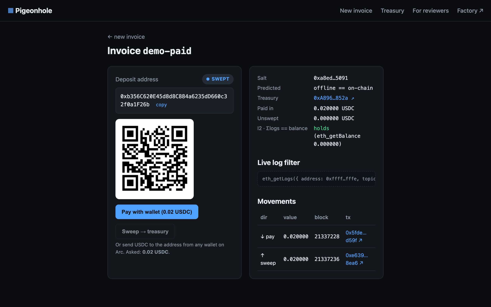

<div align="center">


# Pigeonhole

### A fresh USDC deposit address per invoice — with no private key to guard

Every invoice gets its own Arc address that exists *before any contract does*. When it's paid, one
permissionless transaction sweeps it to your treasury and the address disappears — reusable forever,
with no key anywhere in the system.



<br/>

[](https://pigeonhole.edycu.dev/)
[](https://pigeonhole.edycu.dev/#/judge)
[](https://explorer.arc.io/address/0x942b8c102e73aeea1a652ebC8F2d319fD08D9A40)
[](https://dorahacks.io/hackathon/arc-microgrants/detail)

<br/>


[](https://github.com/edycutjong/pigeonhole/actions/workflows/ci.yml)
[](https://github.com/edycutjong/pigeonhole/actions/workflows/codeql.yml)


</div>

---

## 📸 See it in action

<div align="center">
  
</div>

> **Invoice id → codeless address → PAID from one log → Sweep in one tx → address gone.** The screenshot is the seeded
> `demo-paid` cycle on the production factory, read live from Arc mainnet — `Paid in`, `Unswept` and the `I2 · Σlogs == balance`
> line come from `eth_getLogs` + `eth_getBalance`, nothing else. Reviewer path, receipts and reproduce steps: [`JUDGE.md`](./JUDGE.md).

---

## 💡 The problem

A merchant or exchange that wants one deposit address per customer/invoice does it the hard way:
HD-derived addresses, each a private key to generate, store, guard, and later sign a sweep with.
Circle's own exchange-integration guide prescribes exactly this. Keys are the liability.

## 🕊️ What Pigeonhole does

The deposit address is a **counterfactual `CREATE2` address** — computable offline, with no code and
no key. It receives USDC like any address. To collect, anyone calls `sweep(salt)`: the factory deploys
a 22-byte throwaway (`PUSH20 treasury; SELFDESTRUCT`) at that exact address; its constructor moves the
whole balance to an **immutable treasury** and self-destructs in the same transaction. EIP-6780 fully
deletes it, so the address returns to *no code, nonce 0* and can be paid and swept again forever.

**There is no private key for any deposit address, and funds can only ever reach the treasury.**

## 🔵 Why this needs Arc — and only Arc

It uses **Arc for the one property no other EVM chain has: USDC *is* the native balance.**

- On Arc, a codeless address holds native USDC and `SELFDESTRUCT` moves it (docs: *"SELFDESTRUCT is allowed on Arc, including during contract deployment"* and moves the native balance). On every other EVM chain USDC is an ERC-20 in the token contract — a self-destruct can't touch it, so the whole mechanism is impossible.
- **USDC-as-gas** → deposit addresses, sweeps, and the merchant all live in one asset; no ETH, ever.
- **EIP-7708 native `Transfer` logs** from the system emitter → "PAID" is a single `eth_getLogs`; **no backend, no database, no indexer.**
- **Deterministic finality** → a payment is final in the block that includes it; the page polls the log every 3 s and never shows a confirmation counter. (Latency was not benchmarked — see `DEMO.md`.)

Take Arc out and you'd need: a key-management service (HD wallets + signing), an ERC-20 sweep contract per address or a hot wallet, an indexer to detect payments, and a separate gas token. Pigeonhole replaces all four with one 61-line contract and a static page.

## 🧾 Proof (all on mainnet)

- **Verified live:** `npm run verify` — offline `predict()` byte-matches on-chain `predict()` for 50 random ids, and invariant I2 (Σin − Σout == balance) holds for both seeded invoices. No wallet needed. The page runs the same I2 check on every refresh and shows it.
- **37 tests:** 12 Foundry (incl. a fuzz test + invariants I1 no-code-after-sweep, I3 funds-only-to-treasury) + 25 vitest (offline formula vs real on-chain addresses, the no-DB reducer, decimals, and eight regression tests named for the `eth_getLogs` defects they pin: the 10k-block cap, poll overlap, RPC head skew, re-created invoice ids, the invalidate-while-scanning race).
- **20,000 property-based cases** (fast-check, `test/properties.test.ts`) per `npm test`: the ledger's Σin − Σout identity and status rules over random log sets, order-independence under any permutation, `predict()` against viem's *independent* CREATE2 implementation for random factory/treasury/salt triples, and the chunker never asking the RPC for ≥ 10,000 blocks.
- **34 E2E checks** (Playwright, desktop + mobile) against the production bundle, read-only on mainnet: `/judge` renders with no session, the seeded `demo-paid` invoice reads SWEPT from the system emitter with I2 holding, the treasury view lists real `Swept` events.
- **Benchmark (invariant I4):** a balance-moving sweep on the production factory costs **64,162 gas (p50) ≈ $0.0013** — N=25 in `bench/results.json`, min 64,150 when the salt happens to contain a zero byte (calldata pricing, not execution); the probe factory, a different contract, measures 64,140.
- **Edge cases with tx links** (re-pay after sweep, empty sweep, native send **and** ERC-20 `transfer()` payment — both flip PAID from the same system-emitter log): [`DEMO.md`](./DEMO.md).

## 🚀 Run it
```sh
git clone --recurse-submodules https://github.com/edycutjong/pigeonhole && cd pigeonhole
npm install
npm run verify                 # read-only proof, no wallet
npm test                       # 25 vitest incl. 20,000 fast-check cases
forge test --root contracts    # 12 contract tests (forge-std is a submodule: `git submodule update --init` if you cloned plain)
npm run dev                    # the page locally
```
No `.env`, no keys: the page is static and reads Arc mainnet anonymously. Only the gas benchmark spends (`.env.example`).

> **For reviewers:** open **[/#/judge](https://pigeonhole.edycu.dev/#/judge)** — the 60-second path, every
> mainnet receipt, and the honest limitations on one page. Mirror: [`JUDGE.md`](./JUDGE.md).

## 🧪 Testing & CI

**6-stage pipeline:** Quality (web + contracts) → Security → Build → E2E → Performance → Deploy gate → GitHub Pages

```sh
npm run ci               # audit + oxlint + tsc + vitest with coverage
npm run e2e              # Playwright (builds and serves dist/ itself)
npm run lighthouse       # Lighthouse CI (100 / 100 / 100 / 91 measured 2026-09-18)
npm run security-scan    # npm audit + gitleaks over the full history
npm run readiness        # fails if any placeholder is left in judge-facing docs
```

| Layer | Tool | Status |
|---|---|---|
| Code quality | oxlint + `tsc --noEmit` | ✅ |
| Unit tests | vitest, 97% statements / 99% lines on `src/lib` | ✅ 25 |
| Property-based | fast-check, 4 properties × 5,000 cases | ✅ 20,000 |
| Contracts | Foundry: fuzz + invariants I1/I3 + gas snapshot | ✅ 12 |
| E2E | Playwright, chromium + Pixel 7, read-only vs mainnet | ✅ 34 |
| Security (SAST) | CodeQL | ✅ |
| Security (SCA) | Dependabot (npm, actions, submodule) + npm audit + license check | ✅ |
| Secret scanning | gitleaks, full history, on every push | ✅ |
| Performance | Lighthouse CI (a11y ≥ 0.9 hard gate) + JS bundle budget | ✅ |
| Releases | semantic tags from conventional commits | ✅ |

## 🎯 Who this is for
Exchanges, PSPs, and invoicing tools that need per-customer deposit addresses without a key-management
system. Pigeonhole is the deposit primitive; the same Arc properties make a small family of
key-optional payment primitives possible.

## 🔭 What's next
- **Batch reconciliation** across thousands of invoices from `Swept` events alone.
- A **primitive family** on the same Arc foundations: keeper-less standing orders (exact gas reimbursed in USDC), exactly-once payment keys, and card-style authorize/capture holds.

## 🩹 What we got wrong (dated, kept here rather than edited away)
- **2026-09-17 — the `eth_getLogs` cap.** Day-2 code assumed the RPC allowed 100k-block spans; it allows 9,999 (10,000 → `-32012`). At ~2 blocks/s the live page would have frozen at "UNPAID" a few hours after deploy. Found by a pre-submission audit, fixed the same evening: every scan is chunked at 9,000 blocks, polled incrementally, and invoice URLs carry their creation block (`?from=`). Three regression tests pin it.
- **2026-09-17 — "first-sweep cost 91,740".** The probe notes read the v1 sweep's 91,740 gas as the cost of sweeping a never-seen *address*. The bench refuted that: all 25 first sweeps cost 64,150–64,162. The extra 27,600 was the never-seen *beneficiary* (v1's wrong treasury). `DEMO.md` now says so.
- **2026-09-17 — "64,140 corrected to 64,162".** Not a correction: 64,140 is the probe factory's bytecode, 64,162 is this one's. Different contracts, both right.

## ⚠️ Limitations (honest)
- The treasury's immutability is also a **single point of failure**: if it were ever blocklisted, unswept invoices freeze until it's unblocked; recovery means a new factory.
- The static page needs an **anonymous Arc RPC** (the docs call early-mainnet RPC "permissioned"), and it scans logs in 9,000-block chunks, one call at a time, paced to what `rpc.mainnet.arc.io` sustains (measured 2026-09-20: ≈0.5 `eth_getLogs`/s; bursts are refused with `-32005`). An invoice URL without `?from=` scans from the factory's deploy block — ≈38 calls per day of chain, so a first read of an old invoice takes minutes (progress is shown; each completed chunk is checkpointed in the browser, so it is never repeated). The seeded `demo-paid` / `demo-erc20` ship a committed history checkpoint (`deployments/history-checkpoints.json` — refresh with `npm run checkpoints`; `npm run verify` re-checks every movement against its receipt) so they open in seconds; the treasury view always scans from the deploy block. When the live I2 check mismatches twice in a row, the page rescans that invoice from the deploy block.
- **Not built:** per-invoice unswept totals and a *Sweep all* button in the treasury view (`sweepMany` exists on-chain and is tested; the page calls `sweep` only). PAID latency is not benchmarked.
- The `?amt=` amount is the merchant's claim — the chain proves what was *paid*.

## 📁 Project structure
```
pigeonhole/
├── contracts/            # PigeonholeFactory.sol (61 lines), Foundry tests, Deploy script
├── src/                  # the static page: lib/ (predict, ledger, chunked getLogs), chain.ts, main.ts
├── test/                 # vitest: formula vs mainnet addresses, reducer, regression + property tests
├── e2e/                  # Playwright specs (smoke, invoice flow, live mainnet, responsive, /judge)
├── scripts/              # verify.ts (read-only proof), bench.sh + bench_stats.py, readiness gate
├── bench/                # N=25 mainnet benchmark rows + results
├── deployments/          # arc-mainnet.json — factory, treasury, seeded cycles, tx hashes
├── docs/                 # DX-REPORT.md, explorer screenshot, README assets
├── DEMO.md · JUDGE.md · ARCHITECTURE.md
└── .github/              # CI/CD, CodeQL, gitleaks, release, Dependabot, community files
```

## 📄 License
[MIT](LICENSE) © 2026 Edy Cu

## 🙏 Acknowledgments
Built for the **Arc Microgrants** program (Circle), September 2026 — on Arc's native-USDC EVM, whose
[documented EVM differences](https://docs.arc.io) are the whole reason this mechanism exists. Thank you for reviewing.
